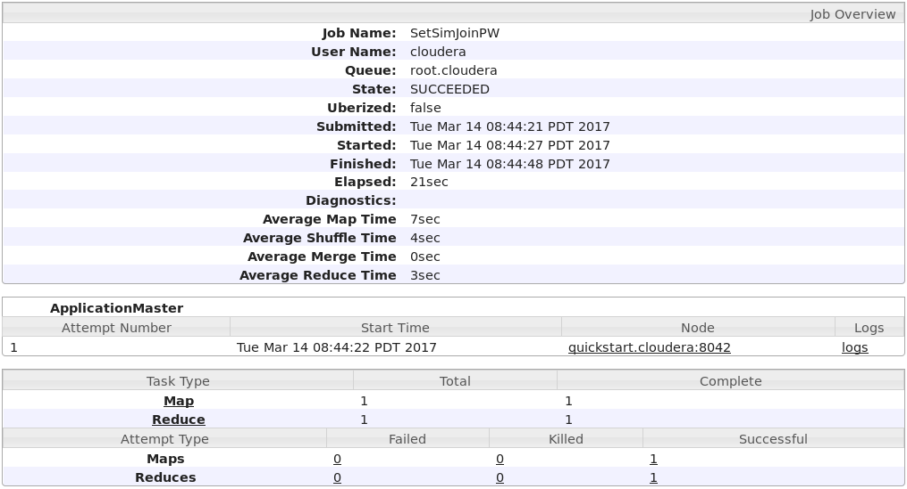
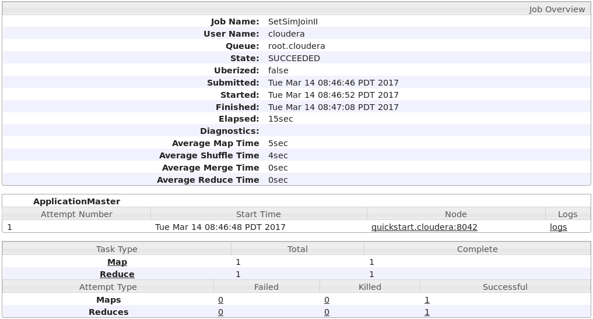

# BDPA Assignment 2 Set-Similarity Joins
###### Hippolyte JACOMET


## Pre-processing step
The goal is to pre-process the document corpus of pg100.txt (from http://www.gutenberg.org/cache/epub/100/pg100.txt) to have only lines of unique words sorted by global frequency, excluding stopwords and clear of special characters. These preprocessed lines will later on be considered as documents for set similarity joins.

To achieve this pre-processing step, we call on the ``stopwords.csv`` file from assignment 1 as well as the ``wordcount.txt`` file from assignment 0.
We also implement a counter that fetches the total number of lines and saves it on HDFS.

### Method
Our approach is the following:
- Main: After having declared a custom counter for the number of lines, the main class runs the Hadoop jobs, and saves the output of the counter of HDFS.
- Mapper: first we implement a ``setup`` class that reads the ``stopwords.csv`` file and stores the words in a single string. Since the default key used by the mapper is the byte offset to the input line, we then create our own ``lineNumber`` variable that is incremented at each call and used as the output key. Finally the `mapper` writes a key-word pair for each word based on the aformentionned conditions.
- Reducer: first we implement a ``setup`` class that reads the ``wordcount.txt`` file and stores its (word, count) pairs in a hashmap. For each key, the ``reducer`` then sorts the values (here, the filterd words of a line) using the wordcount hashmap, and saves them in a string that is eventually outputed in Text format.

#### Main
```java
static enum CustomCounters {NUMLINES}
public static void main(String[] args) throws Exception {
	Configuration conf = new Configuration();

	Job job = Job.getInstance(conf, "InvertedIndex");
	job.setJarByClass(PreProcessing.class);

	job.setOutputKeyClass(LongWritable.class);
	job.setOutputValueClass(Text.class);

	job.setMapperClass(Map.class);
	job.setReducerClass(Reduce.class);

	job.getConfiguration().set("mapreduce.output.textoutputformat.separator", ":");
	job.setNumReduceTasks(1);

	job.setInputFormatClass(TextInputFormat.class);
	job.setOutputFormatClass(TextOutputFormat.class);

	FileInputFormat.setInputPaths(job, new Path(args[0]));
	FileOutputFormat.setOutputPath(job, new Path(args[1]));

	conf.set("mapreduce.map.output.compress", "true");
	conf.set("mapreduce.map.output.compress.codec", "org.apache.hadoop.io.compress.SnappyCodec");


	job.waitForCompletion(true);
	Counter counter = job.getCounters().findCounter(CustomCounters.NUMLINES);

	FileSystem hdfs = FileSystem.get(URI.create("count"), conf);
	Path file = new Path("counter.txt");
	if ( hdfs.exists( file )) { hdfs.delete( file, true ); }
	OutputStream os = hdfs.create(file);
	BufferedWriter br = new BufferedWriter( new OutputStreamWriter( os, "UTF-8" ) );
	br.write("Unique words in a single file = " + counter.getValue());
	br.close();
	hdfs.close();

	System.out.println("Number of lines = " + counter.getValue());
}
```

#### Mapper
```java
public static class Map extends Mapper<LongWritable, Text, LongWritable, Text> {

	String stopwords = new String();
	public void setup(Context context) throws IOException, InterruptedException {
//		Import stop words in a string

//		Test with local file for standalone mode
//			File file = new File("stopwords.csv");
//			Scanner sw = new Scanner(file);

//		With HDFS file
		Path pt=new Path("stopwords.csv");
		FileSystem fs = FileSystem.get(new Configuration());
		Scanner sw=new Scanner(fs.open(pt));

		while (sw.hasNext()){
			stopwords = stopwords + " " + sw.next().toString();
		}
		sw.close();
	}

	private Text word = new Text();
	private LongWritable lineNumber = new LongWritable(0L);

	@Override
	public void map(LongWritable key, Text value, Context context)
			throws IOException, InterruptedException {

		lineNumber.set(lineNumber.get() + 1);

		String line = value.toString().toLowerCase();
		String seen = new String();
		StringTokenizer tokenizer = new StringTokenizer(line, " \t\n\r\f,.:;?![]{}'\"()&<>~_-#$*^%/@\\`=+|");
		while (tokenizer.hasMoreTokens()) {
			word.set(tokenizer.nextToken());
			if (!stopwords.contains(word.toString()) && !seen.contains(word.toString())){
				seen = seen + " " + word.toString();
				context.write(lineNumber, word);
			}
		}
	}
}
```
#### Reducer
```java
public static class Reduce extends Reducer<LongWritable, Text, LongWritable, Text> {

//		Store word count in a hash map
	HashMap<String, Integer> countedWords = new HashMap<String, Integer>();

	public void setup(Context context) throws IOException, InterruptedException {

//		With local file for standalone mode
//			File file = new File("wordcount.txt");
//			Scanner wc = new Scanner(file);

//		With DHFS file
		Path pt=new Path("wordcount.txt");
		FileSystem fs = FileSystem.get(new Configuration());
		Scanner wc=new Scanner(fs.open(pt));

		while (wc.hasNext()){
			String word_count[] = wc.next().toString().split("#");
			countedWords.put(word_count[0], Integer.parseInt(word_count[1]));
		}
		wc.close();
	}

	@Override
	public void reduce(LongWritable key, Iterable<Text> values, Context context)
			throws IOException, InterruptedException {

		List<String> sortedWords = new ArrayList<String>();

		for(Text val: values){
			sortedWords.add(val.toString());
		}

		Collections.sort(sortedWords, new Comparator<String>() {
			public int compare(String s1, String s2) {
				return countedWords.get(s1) - countedWords.get(s2);
			}
		});

//			Without count
		String sortedLine = StringUtils.join(",", sortedWords);

		Text finalLine = new Text();
		finalLine.set(sortedLine);
		context.write(key, finalLine);

//			Here comes the counter...
		context.getCounter(CustomCounters.NUMLINES).increment(1);
	}
}
}
```
There are 114,413 lines according to the counter. Since we are running on pseudo distributed mode, and on a virtual machine, we will downsize this ``preprocessed.txt`` output to a 1,000 rows ``sample.txt`` for the rest of the assignment.

## Set-similarity joins
We aim at finding all the document (or here, lines) pairs that are similar according to the Jaccard metric with a threshold of 0.8. We will do this using first the brute force method of pairwise comparisons, and second an indexing approach following the works of [Chaudhuri et al. 2006].
In both cases we report the number of performed comparisons in a file on HDFS.
We will report below our approaches for both methods and report and compare the results as a conclusion.

The Jaccard similarity of two sets is defined by:
> sim(d1, d2) = Jaccard(d1, d2) = |d1 Ո d2| / |d1 U d2|,

Here is our implementation:
```java
public double jaccard(HashSet<String> hs1, HashSet<String> hs2) {

	if (hs1.size() >= hs2.size()){

		HashSet<String> inter = hs2;
		inter.retainAll(hs1);
		hs1.addAll(hs2);

		int uCard = hs1.size();
		int iCard = inter.size();

		return (double) iCard / uCard;
	}
	else{

		HashSet<String> inter = hs1;
		inter.retainAll(hs2);
		hs2.addAll(hs1);

		int uCard = hs2.size();
		int iCard = inter.size();

		return (double) iCard / uCard;
	}
}
```

### Pairwise comparisons
The approach here is rather straightforward:
- Mapper: A `setup` class first loads all the line numbers in the `kheys` list. For each value, the map class outputs as a key the sorted combination of its own line number with every other in Text format, and the content of the document as value. By sorting the line numbers we make sure that the pairs will match, but perhaps a more refined method would have been to implement our own ``WritableComparable`` to make the pairs.
- Reducer: We store the content of a document pair into a list before parsing their respective contents into HashSets with tokanizers. We then compute the Jaccard similarity of these two sets, and output only the "similar" pairs and their content on hdfs.

#### Mapper
```java
public static class Map extends Mapper<LongWritable, Text, Text, Text> {

//		Get  all document keys in a list of strings
	List<Integer> kheys = new ArrayList<Integer>();

	public void setup(Context context) throws IOException, InterruptedException {

//		With local file for standalone mode
//			File file = new File("sample.txt");
//			Scanner wc = new Scanner(file);

//		With DHFS file
		Path pt=new Path("sample.txt");
		FileSystem fs = FileSystem.get(new Configuration());
		Scanner wc=new Scanner(fs.open(pt));

		while (wc.hasNext()){
			String keyWords[] = wc.next().toString().split(":");
			kheys.add(Integer.parseInt(keyWords[0]));
		}
		wc.close();
	}

	private Text koople = new Text();
	private Text words = new Text();

	@Override
	public void map(LongWritable key, Text value, Context context)
			throws IOException, InterruptedException {

//          Get current document's key
		String line[] = value.toString().split(":");
		int currentKey = Integer.parseInt(line[0]);

//          Get its content
		words.set(line[1]);

//          Iterate over all document keys and generate couples
		for (int k: kheys) {
			if (currentKey < k){
				koople.set(currentKey+ ":" + k);
				context.write(koople, words);
			}
			else if (currentKey > k){
				koople.set(k + ":" + currentKey);
				context.write(koople, words);
			}
		}
	}
}
```

#### Reducer
```java
public static class Reduce extends Reducer<Text, Text, Text, Text> {

	@Override
	public void reduce(Text rkey, Iterable<Text> values, Context context)
			throws IOException, InterruptedException {

		List<String> contents = new ArrayList<String>();

		for (Text val: values){
			contents.add(val.toString());
		}

		HashSet<String> doc1 = new HashSet<String>();
		HashSet<String> doc2 = new HashSet<String>();

		StringTokenizer tokenizer1 = new StringTokenizer(contents.get(0), ",");
		while (tokenizer1.hasMoreTokens()) {
			doc1.add(tokenizer1.nextToken());
		}

		StringTokenizer tokenizer2 = new StringTokenizer(contents.get(1), ",");
		while (tokenizer2.hasMoreTokens()) {
			doc2.add(tokenizer2.nextToken());
		}

		double jackSim = jaccard(doc1, doc2);

		if (jackSim >= 0.8){
			String bingoPair = contents.get(0) + " ~ " + contents.get(1);
			context.write(rkey, new Text(bingoPair));
		}

		context.getCounter(CustomCounters.NUMCOMP).increment(1);
	}
}
```
#### History


### Inverted Index
Here the idea is to avoid pointless comparisons by previously indexing the words: a given word is indexed with all the ids of the documents that contain it. This allows us to look for similar pairs only among the indexed ids of a given word. [Chaudhuri et al. 2006] have shown that, having sorted the words by incresing order of global frequency, it is sufficient to index only the |d| - ⌈t*|d|⌉ + 1 first words of a document, where t is the Jaccard similarity threshold (0.8 here) and |d| is the number of words in d.
Here is our method:
- Mapper: simply get the value's line id, parse and subset its content using [Chaudhuri et al. 2006]'s magical rule, and index each of the few chosen words with the id.
- Reducer: From a given document's id, we have to be able to retrieve the content. The first step is thus to load the document ids and contents in a `keyWords` HashMap with the ``setup`` class. Then, for a given word, all the index ids are stored in the ``billyTheKeys`` list, that we go through with imbricated for loops to make the pairs. The pairs are Jaccard-compared using the values from our ``keyWords`` HashMap, and bingos are outputed in the same fashion as above.

#### Mapper
```java
public static class Map extends Mapper<LongWritable, Text, Text, Text> {

	private Text word = new Text();
	private Text currentKey = new Text();

	@Override
	public void map(LongWritable key, Text value, Context context)
			throws IOException, InterruptedException {

//          Get current document's key
		String line[] = value.toString().split(":");
		currentKey.set(line[0]);

//          Get its content and parse it
		List<String> docWords = new ArrayList<String>();

		StringTokenizer tokenizer = new StringTokenizer(line[1], ",");
		while (tokenizer.hasMoreTokens()) {
			docWords.add(tokenizer.nextToken());
		}

//			Compute number of words to keep
		int magicNumber = docWords.size() - (int) Math.ceil(0.8*docWords.size()) + 1;

//          I'm trying to free your mind, Neo.
		List<String> theChosenOnes = docWords.subList(0, magicNumber);

//          Index'em
		for (String w: theChosenOnes) {
				word.set(w);
				context.write(word, currentKey);
		}
	}
}
```
#### Reducer
```java
public static class Reduce extends Reducer<Text, Text, Text, Text> {

//		Get  all document keys in a list of strings
	HashMap<String, List<String>> keyWords = new HashMap<String, List<String>>();

	public void setup(Context context) throws IOException, InterruptedException {

//		With local file for standalone mode
//			File file = new File("sample.txt");
//			Scanner wc = new Scanner(file);

//		With DHFS file
		Path pt=new Path("sample.txt");
		FileSystem fs = FileSystem.get(new Configuration());
		Scanner wc=new Scanner(fs.open(pt));

		while (wc.hasNext()){
			String document[] = wc.next().toString().split(":");
			List<String> content = new ArrayList<String>();
			StringTokenizer tk = new StringTokenizer(document[1], ",");
			while (tk.hasMoreTokens()) {
				content.add(tk.nextToken());
			}
			keyWords.put(document[0], content);
		}
		wc.close();
	}

	@Override
	public void reduce(Text key, Iterable<Text> values, Context context)
			throws IOException, InterruptedException {

		List<String> billyTheKeys = new ArrayList<String>();

		for (Text val: values){
			billyTheKeys.add(val.toString());
		}

		int n = billyTheKeys.size();

		if (n>1){
			for (int i=0; i<n-1; i++){
				for (int j=i+1; j<n; j++) {
					String iKey = billyTheKeys.get(i);
					String jKey = billyTheKeys.get(j);

					double jackSim = jaccard(new HashSet<String>(keyWords.get(iKey)), new HashSet<String>(keyWords.get(jKey)));
					context.getCounter(CustomCounters.NUMCOMP).increment(1);

					if (jackSim >= 0.8){
						int iI = Integer.parseInt(iKey);
						int jJ = Integer.parseInt(jKey);
						String bingoPairK = Math.min(iI, jJ)+ ":" + Math.max(iI, jJ);

						String iString = StringUtils.join(",", keyWords.get(iKey));
						String jString = StringUtils.join(",", keyWords.get(jKey));

						String bingoPairC = iString + " ~ " + jString;

						context.write(new Text(bingoPairK), new Text(bingoPairC));
					}
				}
			}
		}
	}
}
```

#### History


### Results
The output of both jobs can be found respectively in the `ssj_pw.txt` and `ssj_ii.txt` files. While we find the same 16 pairs for both, it is significant that the Inverted Index method yielded 25 matches with 7 unique couples and 9 (or 18) duplicates. Indeed, as soon as the indexed subsets of two similar documents' content have words in common, both these words are sent to the mapper with the two keys, resulting in the pair beeing evaluated twice. While here this behaviour is neglectable because the documents have few items and the similarity threshold is high (only one word is indexed for a line of 4), it might become a problem at a larger scale.

### Comparing the two methods
Here are the summed up performances of both methods:

Method              | Number of performed comparisons | Execution Time (sec.)  | Elapsed Time (sec.)
------------------- | ------------------------------- | ---------------------- | -------------------
Paiwise comparison  | 499,500                         | 27                     | 21                 
Inverted Index      | 276                             | 21                     | 15                 

We see that even on our small sample the difference in execution times is already significant (inverted indexing is 20% faster) as we have divided the number of comparison by almost 2,000!
We also notice that maths still work as we do have n*(n-1)/2 pairwise comparison, which is extremely satisfying.

## Conclusion
As peviously said there is still room for improvement, starting with implementing a custom WritableComparable for key pairs and solving the duplicate problem of inverted indexing.

## References
>S. Chaudhuri, V. Ganti, and R. Kaushik. A primitive operator for similarity joins in data cleaning. In Proceedings of the 22nd International Conference on Data Engineering, ICDE 2006, 3-8 April 2006, Atlanta, GA, USA, page 5, 2006.
